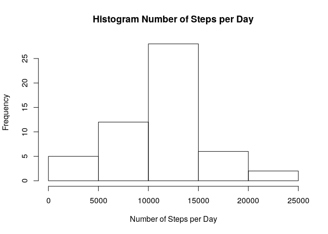
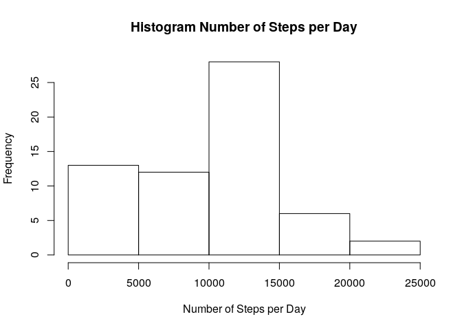

# Reproducible Research: Peer Assessment 1


## Loading and preprocessing the data

```r
# load data from disk
df.data <- read.csv(file = "activity.csv",
                    na.strings = "NA",
                    header = TRUE)
# parse date column
df.data$date <- as.Date(df.data$date)
```


## What is mean total number of steps taken per day?

Making a histogram of the total number of steps taken each day.

```r
histNa <- hist(x = aggregate(formula = steps ~ date,
                             data = df.data,
                             FUN = sum,
                             na.rm = TRUE)$steps,
               main = "Histogram Number of Steps per Day",
               xlab = "Number of Steps per Day")
```

<!-- -->

Calculating and report the **mean** and **median** total number of steps taken per day.

```r
summary <- summary(object = df.data$steps)
```
Then mean is **37.38** and the median is **0**.

## What is the average daily activity pattern?

Making a time series plot of the 5-minute interval (x-axis) and the average number of steps taken, averaged across all days (y-axis).

```r
df.meanPerInterval <- tapply(X = df.data$steps,
                             INDEX = df.data$interval,
                             FUN = mean,
                             na.rm = TRUE)
plot(y = df.meanPerInterval,
     x = names(df.meanPerInterval),
     type = "l",
     main = "5-Minute Interval and Average Number of Steps",
     xlab = "5-minute interval",
     ylab = "Average Number of Steps")
```

<!-- -->

Getting the 5-minute interval which, on average across all the days in the dataset, contains the maximum number of steps.


```r
maxIntervall <- names(which.max(df.meanPerInterval))
```
The 5-minute interval which, on average across all the days in the dataset, contains the maximum number of steps  is **835**.

## Imputing missing values
Calculating and report the total number of missing values in the dataset (i.e. the total number of rows with `NA`s).


```r
missing <- table(complete.cases(df.data))
```
The total number of missing values in the dataset (i.e. the total number of rows with `NA`s) is **2304**.

Devising a strategy for filling in all of the missing values in the dataset: Using the mean for that day.

```r
df.dayMeanStep <- tapply(X = df.data$steps,
                         INDEX = df.data$date,
                         FUN = mean,
                         rm.na = TRUE)
df.dayMeanStep[is.na(df.dayMeanStep)] <- 0
```

Creating a new dataset that is equal to the original dataset but with the missing data filled in.

```r
df.dataComplete <- df.data
df.dataComplete$steps <- ifelse(test = is.na(df.data$steps),
                                yes = df.dayMeanStep[as.character(df.data$date)],
                                no = df.data$steps)
```
Making a histogram of the total number of steps taken each day and calculating and reporting the **mean** and **median** total number of steps taken per day.


```r
histComplete <- histNa <- hist(x = aggregate(formula = steps ~ date,
                                             data = df.dataComplete,
                                             FUN = sum,
                                             na.rm = TRUE)$steps,
                               main = "Histogram Number of Steps per Day",
                               xlab = "Number of Steps per Day")
```

<!-- -->


```r
summary2 <- summary(object = df.dataComplete$steps)
```
Then imputed mean is **32.48** and the imputed median is **0**.

The imputed values differ from the original values by having most NA step counts imputed by 0 steps per interval. This is indicated e.g. by a 4.9 steps lower mean and a 12 steps lower 3rd quartile.

## Are there differences in activity patterns between weekdays and weekends?

Creating a new factor variable in the dataset with two levels -- "weekday" and "weekend" indicating whether a given date is a weekday or weekend day.


```r
df.dataComplete$isWeekday <- ifelse( test = (weekdays(df.dataComplete$date) %in% c("Montag",
                                                                                   "Dienstag",
                                                                                   "Mittwoch",
                                                                                   "Donnerstag",
                                                                                   "Freitag")),
                                     yes = "weekday",
                                     no = "weekend")
```


Making a panel plot containing a time series plot of the 5-minute interval (x-axis) and the average number of steps taken, averaged across all weekday days or weekend days (y-axis).


```r
df.meanPerIntervalWeekday <- tapply(X = df.dataComplete$steps,
                                    INDEX = list(df.dataComplete$interval,
                                                 df.dataComplete$isWeekday),
                                    FUN = mean)
par(mfcol = c(1,2))
plot(y = df.meanPerIntervalWeekday[,1],
     x = rownames(df.meanPerIntervalWeekday),
     type = "l",
     main = "Weekday",
     xlab = "5-minute interval",
     ylab = "Average Number of Steps")
plot(y = df.meanPerIntervalWeekday[,2],
     x = rownames(df.meanPerIntervalWeekday),
     type = "l",
     main = "Weekend",
     xlab = "5-minute interval",
     ylab = "Average Number of Steps")
```

<!-- -->

